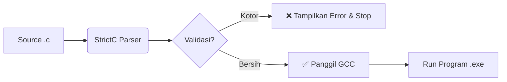

# 🛡️ StrictC: The Disciplined C Compiler

> **"Write Clean Code, or Don't Compile at All."**


## 📖 About StrictC

**StrictC** adalah sebuah *Domain Specific Language* (DSL) yang dirancang sebagai *subset* dari bahasa pemrograman C standar (C11).

Berbeda dengan compiler C biasa yang membiarkan Anda menulis kode yang berantakan asalkan sintaksnya benar, **StrictC bertindak sebagai "Satpam Kualitas"**. Ia memodifikasi grammar dan logika parser untuk **menolak** kode yang melanggar prinsip *Clean Code* dan *Structured Programming*.

Jika kode Anda "kotor", StrictC akan menolak untuk mengkompilasinya. Jika "bersih", StrictC akan memanggil GCC untuk menjalankannya.

---

## 🚀 Key Features (The Trinity + 1)

StrictC menerapkan 4 aturan "harga mati" yang tidak bisa ditawar:

### 1. 🚫 No Spaghetti Code (Anti-Goto)
Perintah `goto` dihapus dari grammar bahasa. Anda dipaksa menggunakan struktur kontrol yang jelas (`if`, `for`, `while`) untuk alur program yang mudah dibaca.

### 2. 🛡️ Safety First (Mandatory Braces)
Dilarang menulis *control flow* tanpa kurung kurawal.
* ❌ **Salah:** `if (x) return;`
* ✅ **Benar:** `if (x) { return; }`
Ini mencegah bug fatal akibat kesalahan indentasi (*scope error*).

### 3. ✂️ Keep It Short (Max 20 Lines)
Satu fungsi tidak boleh lebih dari **20 baris** kode. Ini memaksa penerapan *Single Responsibility Principle* (SRP). Jika fungsi Anda terlalu panjang, pecah menjadi fungsi-fungsi kecil!

### 4. 🧠 Keep It Simple (Max 5 Params)
Fungsi dibatasi maksimal memiliki **5 parameter**. Jika Anda butuh lebih banyak data, gunakan `struct`.

---

## 🛠️ Tech Stack & Architecture

StrictC dibangun di atas teknologi berikut:

* **Frontend:** [ANTLR v4](https://www.antlr.org/) (Lexer & Parser Generator)
* **Backend Logic:** Python 3 (Visitor Pattern & Semantic Analysis)
* **Compiler Core:** GCC (GNU Compiler Collection) untuk eksekusi akhir.

### Alur Kerja (Workflow)

### 📥 Installation

1. Pastikan Anda sudah menginstal Python 3, Java (untuk ANTLR tool), dan GCC.
```bash
git clone [https://github.com/username-anda/StrictC.git](https://github.com/username-anda/StrictC.git)
cd StrictC
```
2. Install Runtime ANTLR untuk Python:
```bash
pip install antlr4-python3-runtime
```
3. (Opsional) Generate Ulang Parser (Jika mengubah grammar):
```bash
antlr4 -Dlanguage=Python3 -visitor -listener C.g4
```

### 💻 Usage

Jalankan program utama menggunakan Python:
```bash
python main.py
```
Anda akan melihat menu interaktif:
```bash
=== StrictC Compiler & Executor ===
Ketik nama file .c untuk di-scan dan dijalankan.
Input File > hello_strict.c
```
Contoh Skenario
1. Input: bad_code.c (Melanggar Aturan)
      ```bash
    void main() {
        int x = 10;
        if (x > 5) return; // Error: Tidak ada kurung kurawal {}
        goto label;        // Error: Goto dilarang
    }
    ```
   Output StrictC:
    ```bash
    >>> Scanning: bad_code.c
        [PELANGGARAN] Baris 3:15 -> Control flow WAJIB menggunakan kurung kurawal '{}'.
        [PELANGGARAN] Baris 4:4 -> Penggunaan 'goto' DILARANG keras di StrictC.
    
    !!! KOMPILASI DIBATALKAN: Kode tidak memenuhi standar StrictC !!!
    ```
2. Input: good_code.c (Clean Code)
   ```bash
   #include <stdio.h>
    void sapa() {
        printf("Halo, StrictC!\n");
    }
    
    int main() {
        sapa();
        return 0;
    }
    ```
   Output StrictC:
   ```bash
   >>> Scanning: good_code.c
    [BERSIH] Kode Valid & Aman.
    >>> StrictC mengizinkan eksekusi. Memanggil GCC...
    >>> Kompilasi Sukses! Menjalankan program...
    ----------------------------------------
    Halo, StrictC!
    
    ----------------------------------------
    ```

### 👥 Authors

Project ini dikembangkan untuk memenuhi Tugas Besar mata kuliah Programming Language Pragmatics di Politeknik Negeri Bandung.
### - Fariz Dhifa Fakhriza
### - Aulia Rachmad Adiwinarta
### - Idotoho Reimon Simanjuntak
