# 🛡️ StrictC: The Disciplined C Compiler

> **"Write Clean Code, or Don't Compile at All."**


## 📖 About StrictC

**StrictC** adalah sebuah *Domain Specific Language* (DSL) dan *Build System* yang dirancang sebagai *subset* dari bahasa pemrograman C standar (C11).

Berbeda dengan compiler C biasa yang membiarkan Anda menulis kode yang berantakan asalkan sintaksnya benar, **StrictC bertindak sebagai "Satpam Kualitas"**. Ia memodifikasi grammar dan logika parser untuk **menolak** kode yang melanggar prinsip *Clean Code* dan *Structured Programming*.

**StrictC menerapkan prinsip "Atomic Build":**
StrictC memindai satu folder proyek sekaligus. Jika ada **SATU** saja file (baik `.c` maupun `.h`) yang "kotor", StrictC akan menolak mengkompilasi seluruh proyek. Hanya jika semua file "bersih", StrictC akan menggabungkan (*link*) semuanya dan memanggil GCC.

---

## 🚀 Key Features

### The Trinity of StrictC (Core Rules)
StrictC menerapkan 4 aturan "harga mati" pada setiap file:

1.  🚫 **No Spaghetti Code (Anti-Goto)**
    Perintah `goto` dihapus dari grammar bahasa. Anda dipaksa menggunakan struktur kontrol yang jelas (`if`, `for`, `while`).
2.  🛡️ **Safety First (Mandatory Braces)**
    Dilarang menulis *control flow* tanpa kurung kurawal. `if (x) return;` adalah **Error**. Wajib `if (x) { return; }`.
3.  ✂️ **Keep It Short (Max 50 Lines)**
    Satu fungsi tidak boleh lebih dari **50 baris** kode.
4.  🧠 **Keep It Simple (Max 5 Params)**
    Fungsi dibatasi maksimal memiliki **5 parameter**.

### Modular Project Features 📦
* **Recursive Scanning:** Otomatis mencari semua file `.c` dan `.h` dalam folder dan sub-folder.
* **Header Validation:** File header (`.h`) juga diperiksa ketaatannya terhadap aturan StrictC.
* **Automated Linking:** Jika validasi sukses, semua file sumber otomatis di-*link* menjadi satu executable menggunakan GCC.

---

## 🛠️ Tech Stack & Architecture

StrictC dibangun di atas teknologi berikut:
* **Frontend:** [ANTLR v4](https://www.antlr.org/) (Lexer & Parser Generator)
* **Backend Logic:** Python 3 (Visitor Pattern, Semantic Analysis, & Build System)
* **Compiler Core:** GCC (GNU Compiler Collection) untuk eksekusi akhir.

### Alur Kerja (Project Workflow)

```mermaid
graph TD
    A[Start: Input Folder] --> B[Recursive Scan .c & .h]
    B --> C{Loop Check Files}
    C --> D[Validasi Grammar & Logic]
    D -- Error Found --> E[Tandai Project: DIRTY]
    D -- Valid --> F[Tandai File: CLEAN]
    F --> C
    E --> C
    C -- Selesai Loop --> G{Decision Gate}
    G -- Ada File Error --> H[❌ BUILD FAILED & Stop]
    G -- Semua Bersih --> I[✅ GCC Linking]
    I --> J[Run Program .exe]
```

### 📥 Installation

1. Pastikan Anda sudah menginstal Python 3, Java (untuk ANTLR tool), dan GCC.
```bash
git clone [https://github.com/username-anda/StrictC.git](https://github.com/username-anda/StrictC.git)
cd StrictC
```
2. Install Runtime ANTLR untuk Python:
```bash
pip install antlr4-python3-runtime
```
3. (Opsional) Generate Ulang Parser (Jika mengubah grammar):
```bash
antlr4 -Dlanguage=Python3 -visitor -listener C.g4
```

### 💻 Usage

1. Scan Satu Proyek (Folder)

Cara paling umum. StrictC akan mengecek seluruh folder, menggabungkan file, dan menjalankannya.
```bash
python main.py .
# Atau folder spesifik
python main.py src/
```
2. Scan File Tunggal
Untuk pengujian cepat pada satu file.
```bash
python main.py main.c
```
###📸 Scenarios
Skenario 1: Proyek Gagal (Build Failed)
Terdapat file helper.c yang melanggar aturan (misal: ada goto).
```bash
>>> Scanning Directory: ./src
  - Found: main.c
  - Found: helper.c

>>> Analyzing: src/helper.c
    [PELANGGARAN] Baris 12:4 -> Penggunaan 'goto' DILARANG keras di StrictC.
    [PELANGGARAN] Baris 25:1 -> Fungsi 'hitung_rumit' terlalu panjang (22 baris).

!!! BUILD FAILED: 2 Pelanggaran ditemukan. Kompilasi dibatalkan. !!!
```

Skenario 2: Proyek Sukses (Build Succeeded)
Semua file bersih. StrictC memanggil GCC.
```bash
>>> Scanning Directory: ./src
  - Found: main.c
  - Found: utils.c

>>> Analyzing: src/main.c ... [BERSIH]
>>> Analyzing: src/utils.c ... [BERSIH]

>>> PROJECT STATUS: CLEAN (100%)
>>> StrictC mengizinkan eksekusi. Memanggil GCC...
>>> Linking: gcc src/main.c src/utils.c -o main
>>> Running Program...
----------------------------------------
Halo, ini adalah output dari StrictC!
Perhitungan: 10 + 20 = 30
----------------------------------------
```

### 👥 Authors

Project ini dikembangkan untuk memenuhi Tugas Besar mata kuliah Programming Language Pragmatics di Politeknik Negeri Bandung.
### - Fariz Dhifa Fakhriza
### - Aulia Rachmad Adiwinarta
### - Idotoho Reimon Simanjuntak
